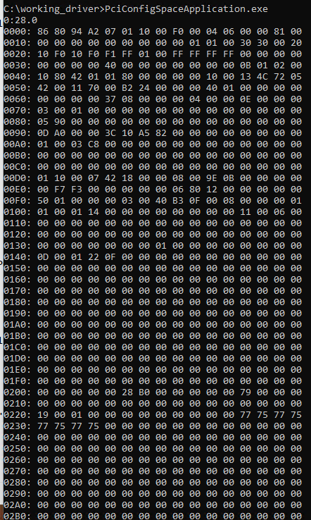
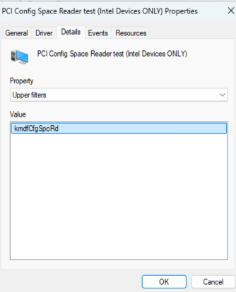
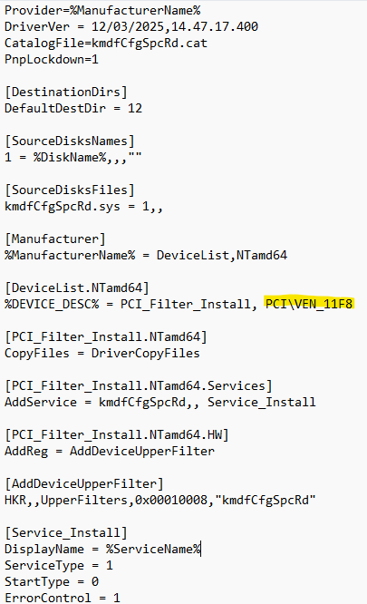

# Windows PCIe Config Space Viewer

A KMDF driver + user-mode application for reading the full 4096-byte PCIe extended config space.

This repository provides a Windows kernel-mode driver and terminal based user-mode tool **(similar to lspci -xxxx)** that allows you to read and inspect PCIe device's extended configuration space. It is intended generally for debugging or checking whether advanced PCIe capabilities are enabled.

## Overview

Windows exposes only the first 256 bytes of PCI configuration space to user-mode applications. As a result, tools such as RWEverything or Windows ports of pciutils cannot access the full 4096-byte PCIe extended configuration space.

This project bypasses that limitation using a custom KMDF kernel driver that reads configuration space directly from hardware. The driver is installed as an upper-filter on the device stack of the target PCIe device, where it obtains the BUS_INTERFACE_STANDARD interface. This allows it to read the complete 4KB extended configuration space, including all extended PCIe capabilities.

## Features

- Reads 4KB PCIe configuration space and BDF (Bus/Device/Function)
- User-mode CLI tool that prints 4KB PCIe configuration space and BDF
- Supports multiple devices

A sample dump is available here: 
result/test_log_harpoon.txt

## How to Run it

### Considerations

- Testsigned drivers reduce system security.

- Make sure no other upper filter is already installed on the target device. You can check this in Device Manager → Properties → Details → Upper Filters.

If there are no Upper Filters listed, this indicates that your driver can be attached.

**Warning: Full functionality of the PCIe device may not work if the vendor-supplied upper filter is replaced by this filter.**

One possible solution is to dump the configuration space, delete the existing driver, and then reattach the vendor-supplied driver.

###

1. Clone the repository and use the files in the artifacts/ directory.
2. Configure the inf. Edit the hardware ID in the .inf file to match the target PCIe device.

By default, the driver matches PMC‑Sierra devices (VEN_11F8).
You must change this if you're targeting another PCIe device.

3. Run Command Prompt as Administrator:

        bcdedit /set testsigning on
&nbsp;&nbsp;&nbsp;&nbsp;&nbsp;&nbsp; Reboot. 

4. Install the driver

        pnputil /add-driver "C:\path\to\kmdfCfgSpcRd.inf" /install

&nbsp;&nbsp;&nbsp;&nbsp;&nbsp;&nbsp; Windows will warn about the unsigned driver — choose Install anyway.

5. Verify the correct device

&nbsp;&nbsp;&nbsp;&nbsp;&nbsp;&nbsp; In Device Manager:

&nbsp;&nbsp;&nbsp;&nbsp;&nbsp;&nbsp; Open System Devices

&nbsp;&nbsp;&nbsp;&nbsp;&nbsp;&nbsp; Find the PCIe device you want to inspect

&nbsp;&nbsp;&nbsp;&nbsp;&nbsp;&nbsp; Right‑click → Properties

&nbsp;&nbsp;&nbsp;&nbsp;&nbsp;&nbsp; Go to Details → Hardware IDs

&nbsp;&nbsp;&nbsp;&nbsp;&nbsp;&nbsp; Confirm it matches the hardware ID in the INF

⚠ **If the hardware ID does not match, STOP.**

Do not install the filter driver on the wrong device.

Re-write the Hardware ID to the one you want instead.

**Example**

If hardware ID in device manager says **PCI\VEN_8086**&DEV_A296&SUBSYS_82A5103C&REV_F0

Replace PCI\VEN_11F8 with PCI\VEN_8086 or do it based off hardware type

[DeviceList.NTamd64]

%DEVICE_DESC% = PCI_Filter_Install, PCI\VEN_8086

6. Attach the driver
- Right‑click the device
- Update driver
- Browse my computer
- Let me pick from a list
- Select PCI Config Space Reader, or choose Have Disk and point to the .inf.
- If it doesnt match do not proceed and change the Hardware ID in .inf to that device.

7. Run the user‑mode tool

       cd C:\path\to\exe
       PciConfigSpaceApplication.exe

&nbsp;&nbsp;&nbsp;&nbsp;&nbsp;&nbsp;You should now see the full 4096‑byte dump plus the BDF.

### 

### Revert change

Remove filter driver: 

    sc delete kmdfCfgSpcRd
    pnputil /delete-driver oemXX.inf /uninstall 
    (oemXX.inf is the INF file Windows assigns during installation)
    bcdedit /set testsigning off

## Future Improvements

- Accept BDF arguments in the user‑mode tool to target a single device
- Add parsing for additional device properties (see [IoGetDeviceProperty](https://learn.microsoft.com/en-us/windows-hardware/drivers/ddi/wdm/nf-wdm-iogetdeviceproperty) and [registry property parsing](https://learn.microsoft.com/en-us/windows-hardware/drivers/ddi/wdm/ne-wdm-device_registry_property)) 
- Add flags to retrieve and print detailed PCIe capability structures similar to different flags in lspci
- Sign the driver so it works with test signing disabled
- Possibly add a GUI

